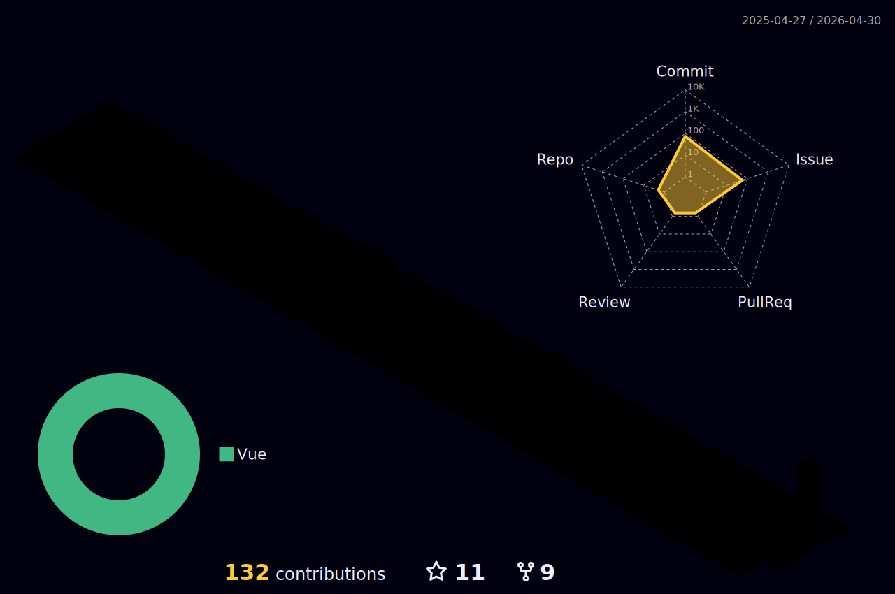

# Hello, welcome! I'm Leonardo 🌈👨🏽‍💻
<p align="right">


</p>

- ✨ <b>Frontend Engineer</b>, aspiring to <b>fullstack</b>
- 🎓 Graduated in <b>Internet Systems Technology</b>
- 📚 Web Fullstack Developer Student at <b>Trybe</b>
<br>
💡 <i>I always love to learn new things and pass on knowledge,the principle of my professional and personal growth comes from that, collabartion and spirit team work.</i>
<br><br>
:notes: Besides programming :computer:
<b>I LOVE</b> to learn about <b>production music</b> too! :musical_keyboard:

* * *

<br />
    
<div align="left">

<a href="https://lcds.vercel.app/">
   
</a> |
<a href="https://www.linkedin.com/in/lcds90/">
  
</a>
<a href="mailto:lcds90@gmail.com">
  
</a>   
 
</div>

<div align="right"> 
       
**Actually** learning:
 


</div>

* * *




* * *
       
<details>
       
<summary>👨🏽‍💻 Professional background as a developer 💻</summary>
    
  <div align="justify">


<div align="center">
<a href="https://wakatime.com/@lcds90">
  
</a>
<a href="https://wakatime.com/@lcds90">
  
</a>
</div>

<br/>

<div align="center">
    
<a href="https://wakatime.com/@lcds90">
  
</a>
<!--  -->


</div>

<br />
              
<!--START_SECTION:waka-->


**🐱 My GitHub Data** 

> 🏆 286 Contributions in the Year 2022
 > 
> 📦 566.5 kB Used in GitHub's Storage 
 > 
> 🚫 Not Opted to Hire
 > 
> 📜 72 Public Repositories 
 > 
> 🔑 43 Private Repositories  
 > 
**I'm a Night 🦉** 

```text
🌞 Morning    150 commits    ████░░░░░░░░░░░░░░░░░░░░░   18.07% 
🌆 Daytime    247 commits    ███████░░░░░░░░░░░░░░░░░░   29.76% 
🌃 Evening    269 commits    ████████░░░░░░░░░░░░░░░░░   32.41% 
🌙 Night      164 commits    █████░░░░░░░░░░░░░░░░░░░░   19.76%

```
📅 **I'm Most Productive on Sunday** 

```text
Monday       133 commits    ████░░░░░░░░░░░░░░░░░░░░░   16.02% 
Tuesday      135 commits    ████░░░░░░░░░░░░░░░░░░░░░   16.27% 
Wednesday    71 commits     ██░░░░░░░░░░░░░░░░░░░░░░░   8.55% 
Thursday     98 commits     ███░░░░░░░░░░░░░░░░░░░░░░   11.81% 
Friday       121 commits    ███░░░░░░░░░░░░░░░░░░░░░░   14.58% 
Saturday     111 commits    ███░░░░░░░░░░░░░░░░░░░░░░   13.37% 
Sunday       161 commits    ████░░░░░░░░░░░░░░░░░░░░░   19.4%

```


📊 **This Week I Spent My Time On** 

```text
⌚︎ Time Zone: America/Sao_Paulo

💬 Programming Languages: 
Vue.js                   18 hrs 41 mins      ███████████████░░░░░░░░░░   60.94% 
TypeScript               6 hrs 54 mins       █████░░░░░░░░░░░░░░░░░░░░   22.5% 
JavaScript               2 hrs 44 mins       ██░░░░░░░░░░░░░░░░░░░░░░░   8.93% 
JSON                     1 hr 19 mins        █░░░░░░░░░░░░░░░░░░░░░░░░   4.34% 
YAML                     24 mins             ░░░░░░░░░░░░░░░░░░░░░░░░░   1.32%

🔥 Editors: 
VS Code                  30 hrs 39 mins      █████████████████████████   100.0%

💻 Operating System: 
Linux                    30 hrs 39 mins      █████████████████████████   100.0%

```

**I Mostly Code in JavaScript** 

```text
JavaScript               41 repos            ███████████░░░░░░░░░░░░░░   44.57% 
TypeScript               16 repos            ████░░░░░░░░░░░░░░░░░░░░░   17.39% 
HTML                     9 repos             ██░░░░░░░░░░░░░░░░░░░░░░░   9.78% 
Vue                      8 repos             ██░░░░░░░░░░░░░░░░░░░░░░░   8.7% 
CSS                      6 repos             █░░░░░░░░░░░░░░░░░░░░░░░░   6.52%

```


**Timeline**

 


 Last Updated on 01/05/2022 18:55:16 UTC
<!--END_SECTION:waka-->
              
              
   </div>
</details>
