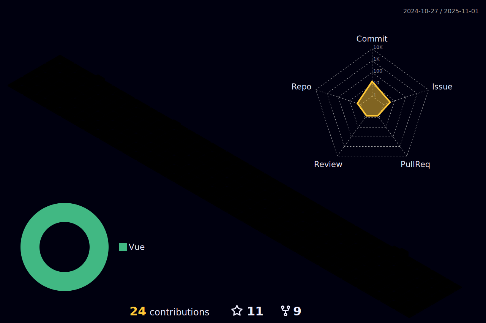

# Hello, welcome! I'm Leonardo 🌈👨🏽‍💻
<p align="right">


</p>

- ✨ <b>Frontend Engineer</b>, aspiring to <b>fullstack</b>
- 🎓 Graduated in <b>Internet Systems Technology</b>
- 📚 Web Fullstack Developer Student at <b>Trybe</b>
<br>
💡 <i>I always love to learn new things and pass on knowledge,the principle of my professional and personal growth comes from that, collabartion and spirit team work.</i>
<br><br>
:notes: Besides programming :computer:
<b>I LOVE</b> to learn about <b>production music</b> too! :musical_keyboard:

<div align=center>
    
 [](https://spotify-github-profile.vercel.app/api/view?uid=lcds90&redirect=true)
    
</div>

* * *

<br />
    
<div align="left">

<a href="https://lcds.vercel.app/">
   
</a> |
<a href="https://www.linkedin.com/in/lcds90/">
  
</a>
<a href="mailto:lcds90@gmail.com">
  
</a>   
 
</div>

<div align="right"> 
       
**Actually** learning:
 


</div>

* * *




* * *
       
<details>
       
<summary>👨🏽‍💻 Professional background as a developer 💻</summary>
    
  <div align="justify">


<div align="center">
<a href="https://wakatime.com/@lcds90">
  
</a>
<a href="https://wakatime.com/@lcds90">
  
</a>
</div>

<br/>

<div align="center">
    
<a href="https://wakatime.com/@lcds90">
  
</a>
<!--  -->


</div>

<br />
              
<!--START_SECTION:waka-->


**🐱 My GitHub Data** 

> 🏆 1,256 Contributions in the Year 2022
 > 
> 📦 663.0 kB Used in GitHub's Storage 
 > 
> 🚫 Not Opted to Hire
 > 
> 📜 83 Public Repositories 
 > 
> 🔑 68 Private Repositories  
 > 
**I'm a Night 🦉** 

```text
🌞 Morning    109 commits    ███░░░░░░░░░░░░░░░░░░░░░░   11.5% 
🌆 Daytime    234 commits    ██████░░░░░░░░░░░░░░░░░░░   24.68% 
🌃 Evening    378 commits    ██████████░░░░░░░░░░░░░░░   39.87% 
🌙 Night      227 commits    ██████░░░░░░░░░░░░░░░░░░░   23.95%

```
📅 **I'm Most Productive on Sunday** 

```text
Monday       99 commits     ██░░░░░░░░░░░░░░░░░░░░░░░   10.44% 
Tuesday      117 commits    ███░░░░░░░░░░░░░░░░░░░░░░   12.34% 
Wednesday    41 commits     █░░░░░░░░░░░░░░░░░░░░░░░░   4.32% 
Thursday     90 commits     ██░░░░░░░░░░░░░░░░░░░░░░░   9.49% 
Friday       63 commits     █░░░░░░░░░░░░░░░░░░░░░░░░   6.65% 
Saturday     201 commits    █████░░░░░░░░░░░░░░░░░░░░   21.2% 
Sunday       337 commits    █████████░░░░░░░░░░░░░░░░   35.55%

```


📊 **This Week I Spent My Time On** 

```text
⌚︎ Time Zone: America/Sao_Paulo

💬 Programming Languages: 
Vue.js                   14 hrs 31 mins      █████████████████░░░░░░░░   69.65% 
JavaScript               2 hrs 49 mins       ███░░░░░░░░░░░░░░░░░░░░░░   13.58% 
JSON                     1 hr 56 mins        ██░░░░░░░░░░░░░░░░░░░░░░░   9.32% 
TypeScript               1 hr 26 mins        █░░░░░░░░░░░░░░░░░░░░░░░░   6.89% 
CSV                      5 mins              ░░░░░░░░░░░░░░░░░░░░░░░░░   0.48%

🔥 Editors: 
VS Code                  20 hrs 51 mins      █████████████████████████   100.0%

💻 Operating System: 
Linux                    20 hrs 51 mins      █████████████████████████   100.0%

```

**I Mostly Code in JavaScript** 

```text
JavaScript               42 repos            ███████████░░░░░░░░░░░░░░   44.21% 
TypeScript               23 repos            ██████░░░░░░░░░░░░░░░░░░░   24.21% 
Vue                      13 repos            ███░░░░░░░░░░░░░░░░░░░░░░   13.68% 
HTML                     7 repos             █░░░░░░░░░░░░░░░░░░░░░░░░   7.37% 
Python                   6 repos             █░░░░░░░░░░░░░░░░░░░░░░░░   6.32%

```


**Timeline**

 


 Last Updated on 06/11/2022 18:55:51 UTC
<!--END_SECTION:waka-->
              
              
   </div>
</details>
